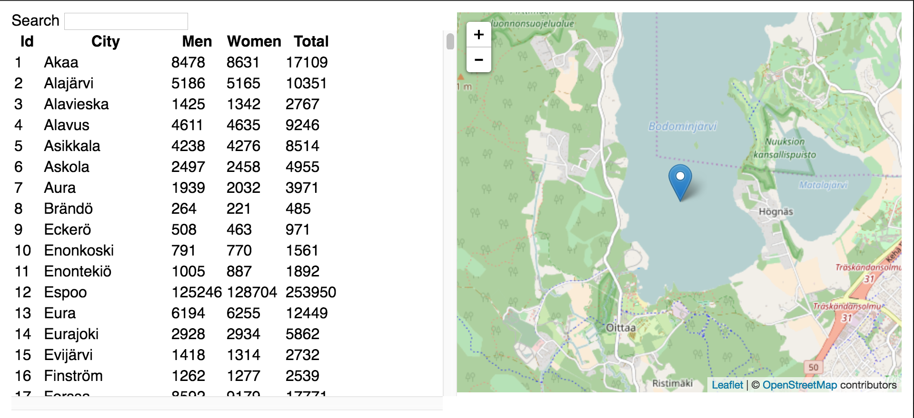

# Getting Start

1. Clone the repo `git clone https://github.com/skyuplam/citystats.git`
2. Go to dir `cd citystats`
3. Install npm packages using [yarn](yarnpkg.com) `yarn install`
4. Run the project `npm start`
5. Visit `http://localhost:3000`

The (kind of) working page can be accessed [here](https://skyuplam.github.io/citystats) (since the data API is not secured, not https. you may not see anything using this link)

# Features

1. Type city name in search box to search city.
2. Click on the header to sort the table, (click again on the same header to change sorting order to ascending/descending)
3. Click city name to show the city location on the map.

# UI

